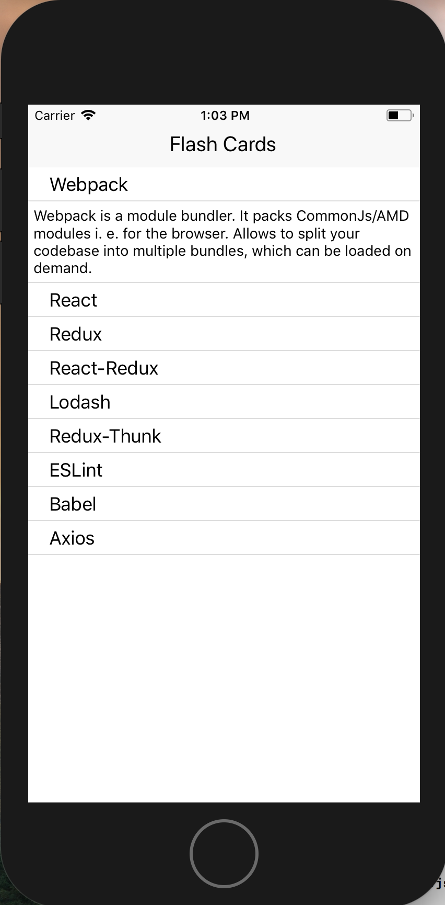

# Flashcard_iOSapp-React-Native

iOS app to display flashcards with scrolling list and LayoutAnimations

# Purpose 

* I created this app to practice React-Native and Redux

## App Functionality:

- App uses react-native and redux to store and show flashcards.

- React-native LayoutAnimations used for clicks

### Screenshots:

